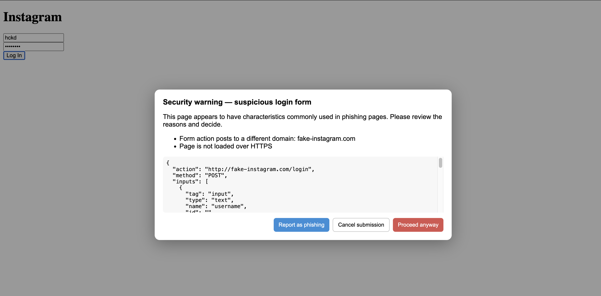

# Fake Form Detection Extension (Enhanced)

### Overview

Fake Form Detection is an advanced Chrome browser extension that detects and alerts users when they attempt to submit credentials on suspicious login forms. The enhanced version includes **machine learning-based detection**, **Google Safe Browsing API integration**, **blacklist/whitelist system**, **expanded brand coverage** (20+ brands), and **JavaScript-based submission interception**. It uses real-time DOM analysis, ML heuristics, and threat intelligence to identify potentially dangerous forms.

### Files and Functionality

This repository has two main parts:

#### `extension/`  
Contains the Chrome extension source code:

- **`manifest.json`** — Defines the Chrome extension, permissions, content scripts, and background service worker.  
- **`config.js`** — Configuration file for API keys, thresholds, and ML weights.  
- **`content_script.js`** — Enhanced script that scans forms, intercepts JavaScript-based submissions (fetch/XHR), integrates ML detection, and displays warning modals.  
- **`utils.js`** — Helper functions for domain extraction, expanded brand detection (20+ brands), and fuzzy matching.  
- **`ml-detector.js`** — Machine learning-based detection using heuristic scoring and pattern matching.  
- **`blacklist.js`** — Blacklist/whitelist management system using Chrome storage.  
- **`service_worker.js`** — Background service worker with Google Safe Browsing API integration and backend support.  
- **`icons/`** — Folder containing extension icons of various sizes.

#### `test-site/`  
Contains a sample `fake-login.html` page to simulate a phishing site for testing the extension.

### Features

#### Core Detection
* ✅ Detects forms that post credentials to untrusted domains
* ✅ Flags forms with hidden inputs, lack of HTTPS, or suspicious branding
* ✅ Observes dynamically added forms (SPAs) using MutationObserver

#### Advanced Features (NEW)
* 🤖 **Machine Learning Detection**: Risk scoring based on weighted heuristics (domain mismatch, HTTPS, hidden inputs, brand impersonation)
* 🔍 **Google Safe Browsing API**: Real-time URL checking against Google's threat database
* 📋 **Blacklist/Whitelist System**: Persistent domain lists with user reporting
* 🎯 **Expanded Brand Coverage**: Detects 20+ brands (Instagram, Facebook, Gmail, Twitter, LinkedIn, Amazon, Microsoft, Apple, GitHub, PayPal, banks, and more)
* ⚡ **JavaScript Interception**: Monitors fetch() and XMLHttpRequest to catch JS-based credential submissions
* 🎨 **Enhanced UI**: Improved warning modal with risk scores and technical details

#### Warning Modal Options
* Cancel submission (blocks the form)
* Proceed anyway (user override)
* Report as phishing (adds to blacklist and sends report)

### Installation

1. Clone or download the repository.
2. **Configure API Key** (optional but recommended):
   - Open `extension/config.js`
   - Get a Google Safe Browsing API key from [Google Cloud Console](https://console.cloud.google.com/apis/credentials)
   - Replace `YOUR_API_KEY_HERE` with your actual API key
3. Open Chrome and navigate to `chrome://extensions/`.
4. Enable **Developer mode**.
5. Click **Load unpacked** and select the `extension` folder.
6. The extension will now be active.

**Note**: See `UPGRADE_GUIDE.md` for detailed setup instructions and configuration options.

### How to Run

1. Open any webpage with a login form or load the `test-site/fake-login.html` file in your browser.
2. The content script automatically scans forms on page load and dynamically added forms.
3. If a form is flagged as suspicious, a modal will appear showing:
   * Reasons for suspicion
   * Form details
4. Users can choose to cancel, proceed, or report the form.

### Example Detection Scenarios

**Scenario 1: Domain Mismatch**
* Form on `phishing-site.com` posts to `steal-creds.com` → **BLOCKED**

**Scenario 2: Brand Impersonation**
* Page looks like Instagram but domain is `instagrarn.com` (typo) → **BLOCKED**

**Scenario 3: JavaScript-Based Submission**
* Site uses `fetch()` to send credentials to suspicious domain → **BLOCKED**

**Scenario 4: Safe Browsing API**
* URL flagged by Google Safe Browsing as phishing → **BLOCKED**

**Scenario 5: Blacklist**
* Domain in user's blacklist → **BLOCKED**

### Risk Scoring Example

```javascript
// ML-based risk evaluation
const formInfo = analyzeForm(form);
const mlResult = mlEvaluateRisk(formInfo, CONFIG);

// Risk Score: 0.65 (65% - HIGH RISK)
// Reasons:
// - Domain mismatch detected
// - Missing HTTPS
// - Brand impersonation (Instagram)
// - 3 hidden inputs found
```

### Testing

1. Load the extension in Chrome using Developer mode.
2. Open demo phishing pages (local or controlled environment) with forms mimicking Instagram, Gmail, or Facebook.
3. Check that warning modals appear for suspicious forms.
4. Open legitimate login pages (Instagram, Gmail) to verify that the extension does not falsely flag them.

### Test Results



## 🆕 What's New in v1.0.0

### Major Upgrades
1. **Machine Learning Detection**: Heuristic-based risk scoring with configurable weights
2. **Google Safe Browsing API**: Integration with Google's threat intelligence
3. **Blacklist/Whitelist**: Persistent domain management system
4. **Expanded Brands**: 20+ brand detection (was 3)
5. **JavaScript Interception**: Catches fetch/XHR credential submissions

### Technical Improvements
- Enhanced brand detection with scoring algorithm
- Pattern matching for typosquatting, subdomain abuse, suspicious TLDs
- Improved modal UI with risk scores and expandable details
- Better error handling and fallbacks
- Configurable thresholds and ML weights

## 📖 Documentation

- **UPGRADE_GUIDE.md**: Comprehensive setup and configuration guide
- **config.js**: All configuration options with comments
- Inline code comments for all major functions

## 🔧 Configuration

Edit `extension/config.js` to customize:
- Risk thresholds
- ML weights
- API keys
- Trusted domains
- Detection sensitivity

## ⚠️ Important Notes

- **API Key Security**: Never commit API keys to public repositories. Use environment variables or a backend proxy for production.
- **Safe Browsing Limits**: Free tier allows 10,000 requests/day
- **Privacy**: Safe Browsing API sends URLs to Google (consider backend proxy)
- **Performance**: ML detection is lightweight; API calls add ~100-200ms latency

## 🤝 Contributing

This is a course project. For production use, consider:
- Backend proxy for Safe Browsing API
- More sophisticated ML models
- Community-maintained blacklists
- Real-time threat intelligence feeds

## 📄 License

Course project - Educational use.

